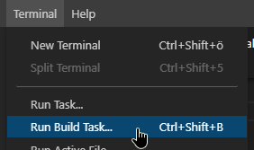

## Building

A quick way to build your application is by using the shortcut button in the upp right corner.\
This will automatically generate and run a VS Code build task.

Remember that VS Code is context sensitive.\
This means that the BlitzMax shortcut buttons will only be visible when editing a BlitzMax source file.

You can also use the `Terminal` menu to run a build task _(Ctrl + Shift + B)_.

If no build task exists you will be prompted to select a template build task.

This will create a new `tasks.json` with your selected template.\
You're now ready to run your build task.

You can always use the BlitzMax build options view to configure your build task once a template has been selected.

The source file for your default build task can be locked.\
Right click any `.bmx` document and select "Set As Default Build Task Source File".

BlitzMax VS Code tasks use the `bmx` task type.\
You can read more about VS Code tasks [here](https://code.visualstudio.com/docs/editor/tasks)