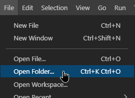
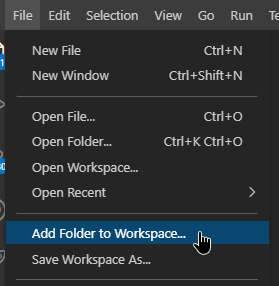
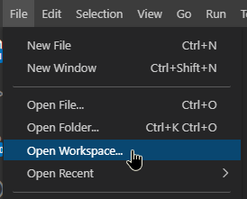

## Folder projects
---
While VS Code works just fine with single source files, it works best for large projects!

A folder project is simply any existing source folder, there is no need for a separate project file.\
Open any BlitzMax source folder via the `File` menu.

This will allow VS Code to create its `.vscode` folder, where any project related settings are stored.

The source file for your project can be locked by right clicking any `.bmx` document and selecting "Set As Default Build Task Source File".

* _This will set the `source` parameter for your default build task.\
Read more in the "Building & Tasks" step._

## Workspaces
---
An alternate - _rarely used_ - version of a folder project is a "workspace".\
It consists of multiple folder projects, all stored at different locations and cannot be a subfolder.

While a workspace has it advantages, it can also be confusing for new users.\
Each folder project inside a workspace still behaves as a separate project, using its own settings, build options and debug configurations.\
But the workspace also has its own `.code-workspace` file, which stores your global workspace settings, build options and tasks.\
The "active" folder project in a workspace will be based on things like your active source document.

A workspace is automatically created when adding more folders to your project.\
Select "Add Folder to Workspace" in the `File` menu to create a workspace.

Unlike a folder project, a workspace needs a separate workspace file.\
This means you will have to use "Open Workspace" in the `File` menu to later open your workspace.

As mentioned before, the workspace file can contain global settings for your entire workspace project.\
These settings usually contains global workspace tasks and editing styles.\
The build options view will display the build task options located in your `.code-workspace` file.